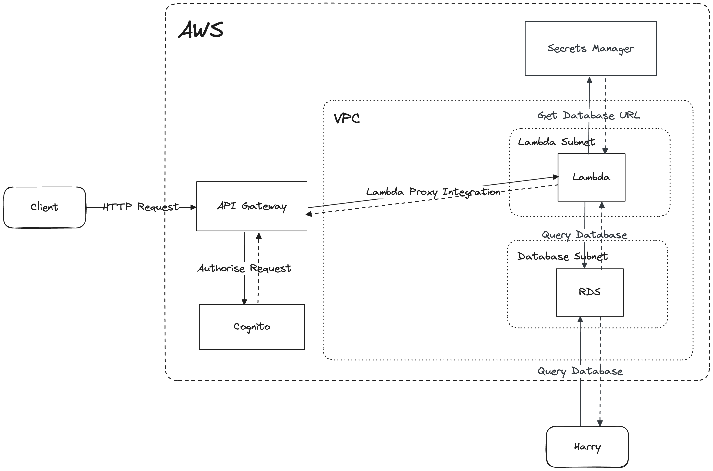

# CurryCompare backend API architecture

 1. Client makes HTTP Request to CurryCompare backend
 2. API Gateway reads the request and determines if it needs authentication
    1. If it **does** need authentication (for example, a consumer is submitting their review, then we call Amazon Cognito to make sure the user is who they say they are and that the user is a consumer)
 3. Once any authentication is complete, the relevant lambda function is invoked.
 4. The lambda function may or may not use the Amazon Aurora database.
 5. The lambda function response json is returned to API Gateway
 6. API Gateway forwards this to the client

