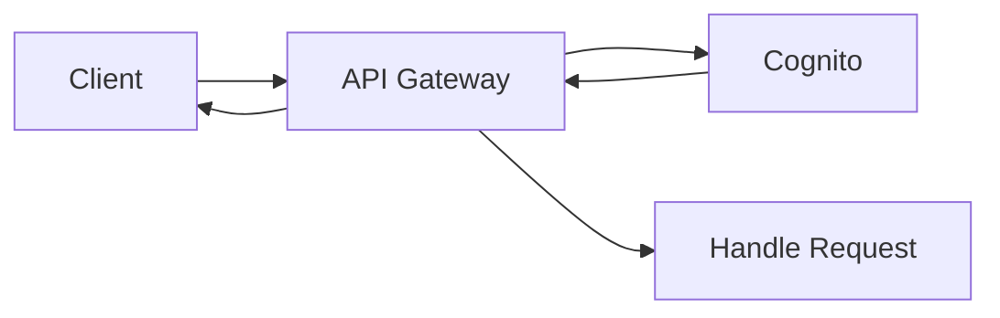

# User authorisation

This document aims to clarify the architecture used to authenicate and authorise users for the purpose of interacting with CurryCompare.

## User Roles

Users can be classifed into four distinct roles:
 - `GUEST` - Somebody who is not logged in to CurryCompare
 - `CONSUMER` - Somebody who consumes curry (logged in but does not own a curry house)
 - `ADMIN` - Somebody who administers curry (logged in and does own a curry house)
 - `GLOBAL_ADMIN` - Somebody who keeps all users in check

Each of these roles is represented by an AWS IAM role.

## AWS Cognito Integration
### Overview
Amazon Cognito provides a robust solution for managing user authentication and authorisation. It enables us to create and maintain a user pool, essentially a directory of all users associated with our application. Within this user pool, users are categorised into distinct groups based on their roles and permissions:

- `CONSUMER`
- `ADMIN`
- `GLOBAL_ADMIN`

It's important to note that the group `GUEST` is intentionally excluded from this list. This is because `GUEST` users are not authenticated users of the system.

### Role Assignment
For each user group, Amazon Cognito allows us to assign a corresponding IAM (Identity and Access Management) Role. This role-based approach ensures that users have appropriate access rights and permissions according to their group membership.

### Integration with Amazon API Gateway
A key feature of Amazon Cognito is its seamless integration with Amazon API Gateway. This integration facilitates the process of user authentication for each API request. By utilising Amazon Cognito as an authoriser in API Gateway, we can securely authenticate users. This is achieved by requiring users to include either an identity or access token in the `Authorization` header of their API requests.

### User Authentication and Management
In addition to role management and API integration, Amazon Cognito streamlines the processes of user login and sign-up. This simplifies the user management lifecycle, encompassing user registration, authentication, and account recovery.

### Flowchart

