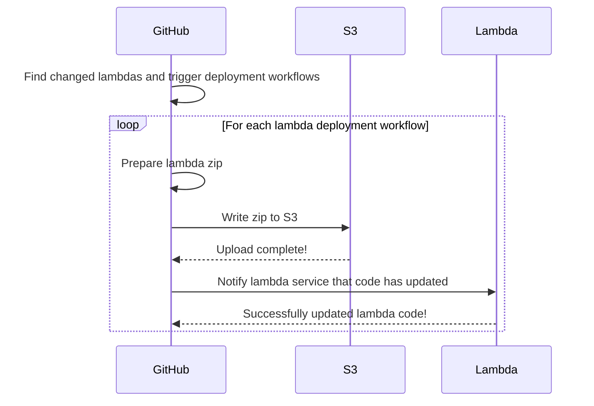

# Deploying Lambdas

```mermaid
sequenceDiagram

GitHub->>GitHub: Find changed lambdas and trigger deployment workflows
loop For each lambda deployment workflow
GitHub->>GitHub: Prepare lambda zip
GitHub->>S3: Write zip to S3
S3-->>GitHub: Upload complete!
GitHub->>Lambda: Notify lambda service that code has updated
Lambda-->>GitHub: Successfully updated lambda code!
end
```