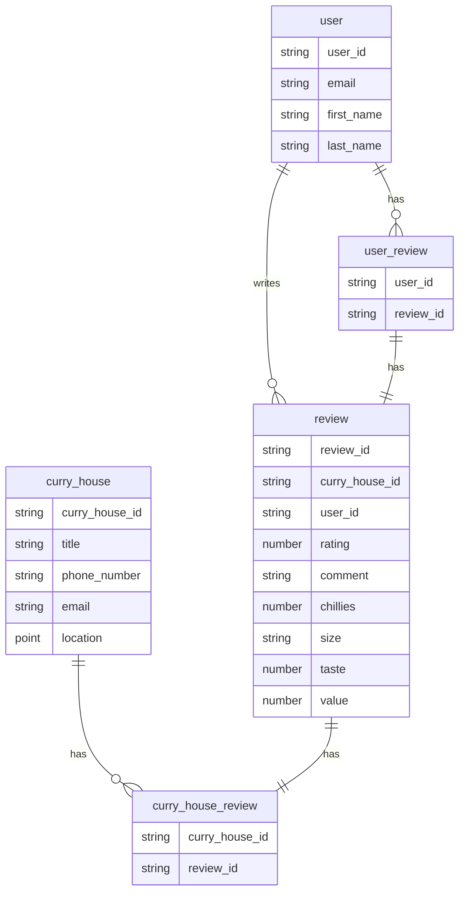

# Database

For our database, we will be using [Amazon Aurora](https://aws.amazon.com/rds/aurora/).

## Data model

```mermaid
erDiagram
user {
  string user_id
  string email
  string first_name
  string last_name
}

user ||--o{ review : writes

review {
  string review_id
  string curry_house_id
  string user_id
  number rating
  string comment
  number chillies
  string size
  number taste
  number value
}

curry_house {
  string curry_house_id
  string title
  string phone_number
  string email
  point location
}

curry_house_review {
  string curry_house_id
  string review_id
}

curry_house ||--o{ curry_house_review : has

review ||--|| curry_house_review : has

user_review {
  string user_id
  string review_id
}

user ||--o{ user_review : has
user_review ||--|| review : has
```