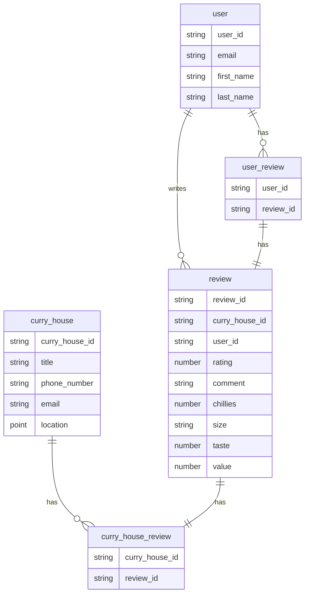

# Database

For our database, we will be using [Amazon RDS](https://aws.amazon.com/rds/). In the future, it would be nice to migrate to Aurora, but it is maybe a little overkill for now.

## Prisma

We will use [prisma](https://www.prisma.io/) to manage our ORM. It will allow us to maintain and version our model in code, and migrate our database easily in a CI/CD pipeline. Prisma allows us to generate types based on the schema and use these types throughout the platform.

### Schema

The prisma schema consists of [data sources](https://www.prisma.io/docs/orm/prisma-schema/overview/data-sources), [generators](https://www.prisma.io/docs/orm/prisma-schema/overview/generators), and the [data model definition](https://www.prisma.io/docs/orm/prisma-schema/data-model). It will be located in `src/prisma/schema.prisma` so that it is effectively in scope for both the front and backend.

- **data sources:** For the data source we can use an environment variable, `DB_URL`, to differentiate between environments, local and cloud-based.
- **generators:** For now we will just be using the default `prisma-client-js` generator, and writing generated assets to `src/prisma/generated`.
- **data model definition:** Here we can maintain the below data model in code and more clearly specify all relations and types.

### CI

When any changes to the data model are made in `main`, we can use [prisma migrate](https://www.prisma.io/docs/orm/prisma-migrate/understanding-prisma-migrate) to migrate the dev database automatically, and then if that succeeds we can apply the migration to the production database, given manual approval.

## Data model

One thing worth noting is that in this diagram, relation tables (such as `curry_house_review`), are explicitly shown. These tables are handy for when there is a many-to-many relationship. Prisma handles these tables implicitly, so in our prisma data model there is not need to specify `curry_house_review` table (but the equivalent table will exist).

